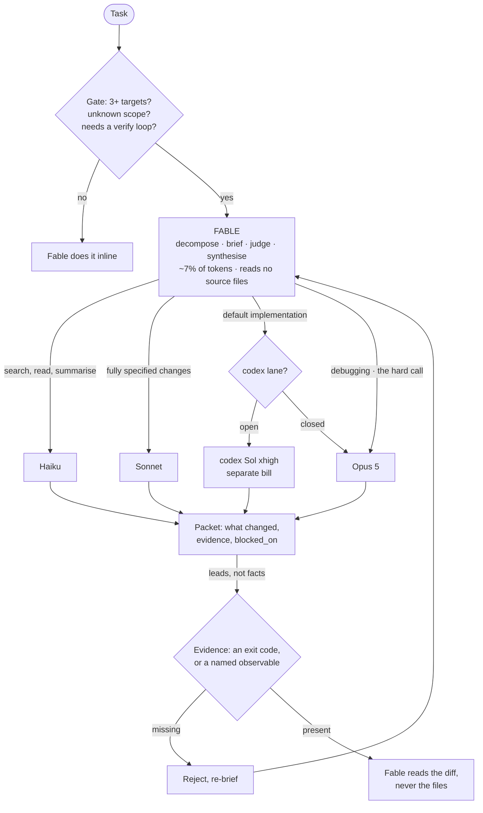

# /efficient-fable

Use Claude Fable where it is worth paying for judgment.

## What it does

Turns Fable 5 into an orchestrator that never touches files. It decomposes the work,
writes self-contained briefs, judges what comes back, and synthesizes, while the actual
reading and typing happens elsewhere.

| Work | codex lane open | codex lane closed |
| --- | --- | --- |
| search, read, summarize, reduce output | Haiku | Haiku |
| changes the brief already specifies | Sonnet | Sonnet |
| **default implementation** | **codex Sol (xhigh)**, ChatGPT bill | **Opus 5** |
| debugging, the one hard call | Opus 5 | Opus 5 |
| plan, brief, judge, synthesize | Fable | Fable |

With the codex lane open, codex runs on a **different subscription**, so implementation
stops consuming Claude quota entirely. Codex is not smarter than Opus 5, Opus 5 leads it
by +14.6 pts on SWE-bench Pro and wins debugging outright, it is separately *billed*. See
[ADR 0002](../.agents/adr/0002-codex-is-a-separate-bill-not-a-better-model.md).

With it closed, nothing degrades. Opus 5 implements, and the orchestration still pays for
itself because the expensive model stops reading files. The skill will not mention codex
or nag you to install it.

## Where it runs

Anywhere skills and subagents exist, Claude Code, Cowork, and other harnesses. The
codex lane needs a shell and a logged-in codex; without one it simply closes.

In a document-shaped environment the pattern is the same with different units: slices are
sections, sheets or folders rather than files, `owns` is the section or tab, and
verification is the artifact opened and inspected rather than an exit code. Two agents
writing one document is the same clobbering problem as two writing one file.

## When to reach for it

The gate is in the skill, and it exists because delegation has a floor of roughly
5 to 7K tokens per round trip. Delegate when the work spans **3+ files**, when you do
not yet know which files it touches, when it needs a build/test loop to verify, or
when two slices can run in parallel. Below that, Fable does it inline, briefing an
agent to read one known file costs more than reading it.

Reach for it on a multi-file refactor, an unfamiliar subsystem, a migration across
call sites. Skip it for a two-line fix, however tempting the machinery is.

## Common questions

**Does Fable actually read nothing?** It reads briefs, returned packets, and `git
diff`, never source files. A diff is 10 to 50× smaller than the files it touches and is
the only artifact that shows what changed.

**How does it know a worker is telling the truth?** It doesn't, and it is told not to
assume: packets are rejected unless they carry real command output with exit codes.
The build is the verifier, not a second model's opinion.

**Why not worktrees for parallel writers?** Each brief declares the paths it owns, and
overlapping slices are serialized instead of isolated. In a monorepo a worktree costs a
fresh install (and pods, on mobile), too much for the conflict it prevents.

**What about `AGENTS.md`?** Codex reads `AGENTS.md`, never `CLAUDE.md`. Step 0 checks
for one and offers to symlink it. It never writes one for you, LLM-authored
`AGENTS.md` files measurably lower success (~3%) and raise cost (20%+).

**Does it work without a codex subscription?** Yes. Evidence gathering, mechanical edits
and Opus 5 implementation all work normally. You lose the separate-bill lane, so the saving
is smaller: the win is that Fable stops spending frontier tokens on file reading, not that
the work moves off your bill.

**Does it probe my machine every time I invoke it?** No, and an earlier version's mistake
was that it did. The lane is decided at the **first handoff**, not at invocation, and read
off the tool list, if a `/codex:*` command is available, the lane is open. Only when
there's no codex tooling but there *is* a shell does it run `codex login status`, once per
session. Most invocations never delegate at all, because the gate ends them, so the check
would have been wasted work in the common case.

**Why not cache the answer in a config file?** Because it goes stale in the direction that
hurts. Your token expires or you switch machines, the file keeps claiming the lane is open,
and handoffs fail for a reason nothing explains. Reading the live tool list cannot be
wrong.

## It's working if

- Fable's share of session tokens stays under ~10%. Published setups land near 93%
  executor / 7% orchestrator; if Fable creeps past that, it has started doing the work.
- Every packet you see carries exit codes, not prose claims of success.
- You review diffs, not file dumps.
- It **declines** to delegate small tasks. A skill that fans out three agents for a
  one-line change has stopped paying for itself.
